# Technical Implementation Plan — Employee Attendance System

## 1. Overview

An employee attendance management system with two frontend apps (Admin & Employee) backed by a NestJS API, MySQL database, Kafka message broker for event-driven audit logging and real-time notifications via SSE.

---

## 2. System Architecture
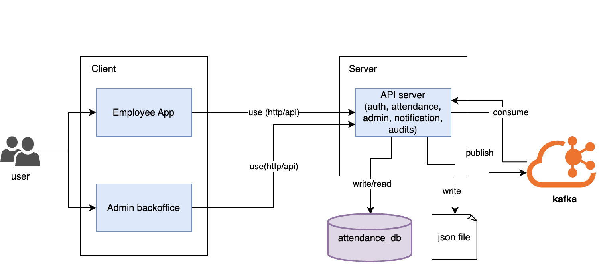

### Event Flow (Kafka)
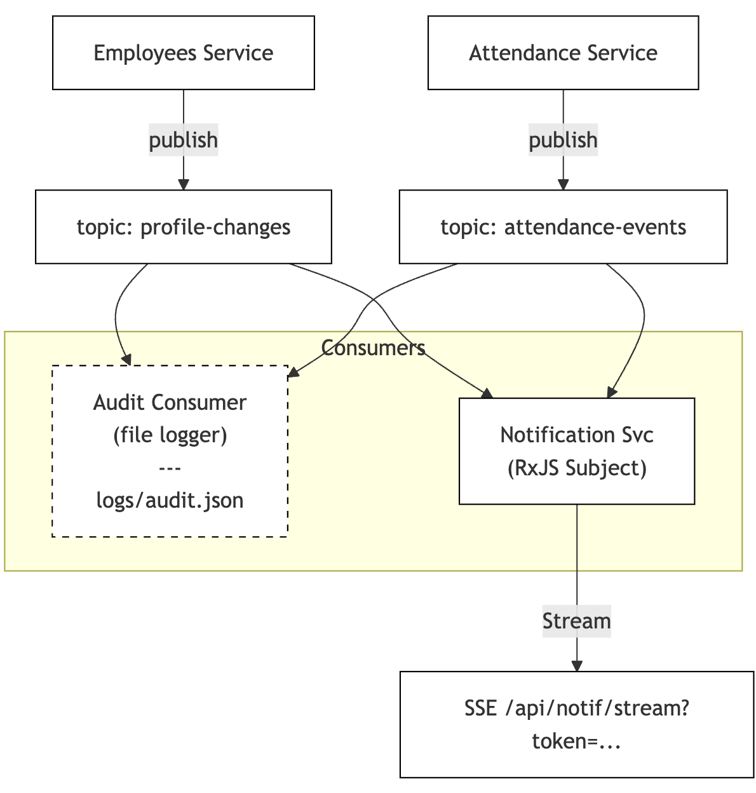

---

## 3. Tech Stack

| Layer        | Technology                          | Version     |
|-------------|--------------------------------------|-------------|
| Backend     | NestJS (Node.js)                     | 11.x        |
| ORM         | TypeORM                              | latest      |
| Database    | MySQL                                | 8           |
| Message Broker | Apache Kafka (KRaft, no Zookeeper) | 3.7.0       |
| Auth        | Passport + JWT (@nestjs/jwt)         | 11.x        |
| Frontend    | React + TypeScript                   | 19.x        |
| Bundler     | Vite                                 | 8.x         |
| CSS         | Tailwind CSS                         | 4.x         |
| HTTP Client | Axios                                | 1.x         |
| Infra       | Docker Compose                       | v2          |

---

## 4. API List

### 4.1 Auth

| Method | Endpoint           | Auth     | Description                       |
|--------|--------------------|----------|-----------------------------------|
| POST   | `/api/auth/login`    | Public   | Login with email/password. Returns `accessToken`, `refreshToken`, employee data. |
| POST   | `/api/auth/refresh`  | Public   | Exchange refresh token for new access token. |

### 4.2 Employees

| Method | Endpoint               | Auth          | Description                              |
|--------|------------------------|---------------|------------------------------------------|
| GET    | `/api/employees/me`    | JWT (any)     | Get current employee's profile.          |
| PATCH  | `/api/employees/me`    | JWT (any)     | Update own profile (phone, password, photo). Publishes `profile-changes` Kafka event. |
| GET    | `/api/employees`       | JWT (admin)   | List employees with pagination & search. |
| POST   | `/api/employees`       | JWT (admin)   | Create new employee.                     |
| PATCH  | `/api/employees/:id`   | JWT (admin)   | Admin update employee fields.            |

### 4.3 Attendance

| Method | Endpoint                | Auth          | Description                              |
|--------|-------------------------|---------------|------------------------------------------|
| POST   | `/api/attendance/clock-in`  | JWT (any) | Clock in. Multiple clock-ins per day allowed. Publishes `attendance-events` Kafka event. |
| POST   | `/api/attendance/clock-out` | JWT (any) | Clock out the latest active session. Publishes `attendance-events` Kafka event. |
| GET    | `/api/attendance/today`     | JWT (any) | Get all attendance records for today (array). |
| GET    | `/api/attendance/summary`   | JWT (any) | Get attendance summary for date range. Returns unique day counts. Query: `?from=YYYY-MM-DD&to=YYYY-MM-DD` |
| GET    | `/api/attendance/all`       | JWT (admin) | List all attendance records with filters. Query: `?page=&limit=&from=&to=&employee_id=` |

### 4.4 Notifications

| Method | Endpoint                         | Auth          | Description                            |
|--------|----------------------------------|---------------|----------------------------------------|
| GET    | `/api/notifications/stream`      | Token (query) | SSE stream for real-time notifications. Admin only. Query: `?token=JWT` |

---

## 5. Data Model

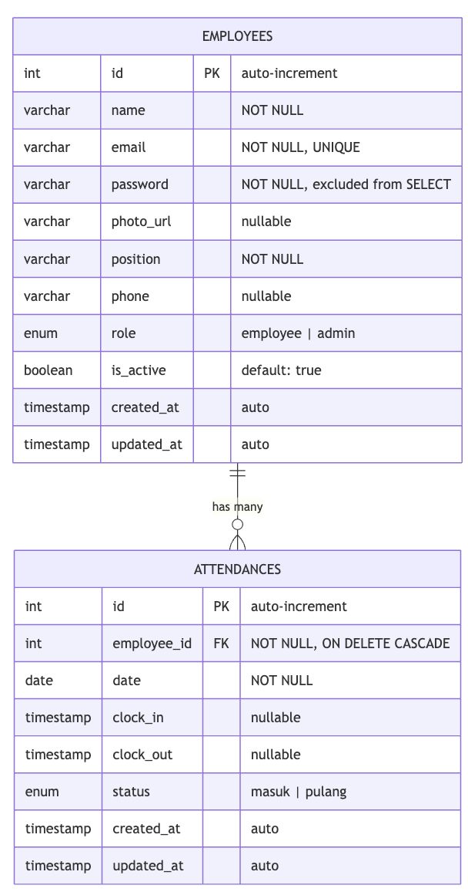

**Notes:**
- One employee can have **multiple attendance records per day** (multiple clock in/out sessions).
- `employee_id + date` is a **non-unique index** (not a unique constraint).
- Deleting an employee **cascades** to all their attendance records.
- Audit log is file-based (`logs/audit.json`), not a database table.

### 5.1 Audit Log (file-based)

Stored at `backend/logs/audit.json`. Each entry:

```json
{
  "action": "clock_in | clock_out | profile_updated",
  "entity": "attendance | employee",
  "entityId": 1,
  "employeeId": 1,
  "employeeName": "John Doe",
  "changes": {},
  "timestamp": "2026-04-02T07:00:00.000Z"
}
```

---

## 6. Authentication & Authorization

| Aspect          | Implementation                                          |
|-----------------|----------------------------------------------------------|
| Strategy        | JWT via Passport (`passport-jwt`)                        |
| Access Token    | 15 minute expiry, sent in `Authorization: Bearer <token>` |
| Refresh Token   | 7 day expiry, exchanged via `/api/auth/refresh`          |
| Password Hashing| bcrypt (salt rounds: 10)                                 |
| Role Guard      | Custom `RolesGuard` + `@Roles('admin')` decorator        |
| SSE Auth        | JWT passed as query parameter `?token=` (browser EventSource limitation) |

---

## 7. Kafka Topics & Consumer Groups

| Topic               | Producer            | Consumers                                         |
|----------------------|---------------------|----------------------------------------------------|
| `profile-changes`    | EmployeesService    | AuditConsumer (`audit-consumer-group`), NotificationsService (`notification-consumer-group` — forwards `profile_updated`) |
| `attendance-events`  | AttendanceService   | AuditConsumer (`audit-consumer-group-attendance`), NotificationsService (`notification-consumer-group-attendance` — filters: only `late_clock_in` and `early_leave` forwarded as notifications; normal clock in/out is audit-only) |

Each consumer uses a separate KafkaJS consumer instance because KafkaJS requires `run()` to be called once per consumer.

---

## 8. Design Patterns

| Pattern           | Where                        | How                                               |
|-------------------|------------------------------|----------------------------------------------------|
| **Observer**       | NotificationsService         | RxJS `Subject` acts as observable; SSE clients are observers subscribing via `getNotificationStream()`. |
| **Event-Driven**   | Kafka pipeline               | Services publish domain events; consumers react asynchronously. Decouples audit/notification from business logic. |
| **Repository**     | TypeORM                      | `Repository<Entity>` injected via `@InjectRepository()`. |
| **Guard/Decorator**| Auth                         | `JwtAuthGuard` + `RolesGuard` + `@Roles()` for declarative access control. |
| **DTO Validation** | Controllers                  | `class-validator` + `ValidationPipe(whitelist, transform)` for input sanitization. |
| **Global Filter**  | HttpExceptionFilter          | Catches all exceptions, returns consistent error response format. |

---

## 9. Frontend Architecture

### 9.1 Employee App (`:5173`)

| Route         | Page                   | Description                          |
|---------------|------------------------|--------------------------------------|
| `/login`      | LoginPage              | Employee login                       |
| `/attendance` | LiveAttendancePage     | Live clock with clock in/out buttons, today's log |
| `/summary`    | AttendanceSummaryPage  | Attendance history with date range   |
| `/profile`    | ProfilePage            | View/edit own profile                |

### 9.2 Admin App (`:5174`)

| Route              | Page                    | Description                        |
|--------------------|-------------------------|------------------------------------|
| `/login`           | LoginPage               | Admin login                        |
| `/employees`       | EmployeeListPage        | Employee list with search/pagination |
| `/employees/new`   | EmployeeFormPage        | Create employee                    |
| `/employees/:id`   | EmployeeFormPage        | Edit employee                      |
| `/attendance`      | AttendanceMonitorPage   | Real-time attendance feed via SSE  |

---

## 10. Key Business Rules

1. **Multiple clock in/out per day**: Employees can clock in and out multiple times in a single day. Each clock-in creates a new attendance record.
2. **Clock out targets active session**: Clock out finds the latest record with `clock_out IS NULL` for today.
3. **Summary counts unique days**: `totalDays` and `totalPresent` use `Set<date>` to deduplicate — 3 sessions in 1 day = 1 day counted.
4. **Profile changes are event-sourced**: Any profile update (phone, password, photo) emits a Kafka event with the list of changed fields.
5. **Admin-only SSE**: Notification stream requires admin JWT.
6. **Photo upload**: Max 5MB, image types only (jpg, jpeg, png, gif, webp). Stored on disk at `backend/uploads/`.

### 10.1 HR Notification Rules

Admin notifications are **filtered for actionable events only** — routine clock in/out does not generate a push notification (still recorded in audit log).

| Notification Type    | Trigger                                             | Severity | Delivery    |
|----------------------|-----------------------------------------------------|----------|-------------|
| `late_clock_in`      | Employee clocks in after 09:15 (configurable)       | High     | Real-time SSE |
| `early_leave`        | Employee clocks out before 15:00 (configurable)     | High     | Real-time SSE |
| `absent_alert`       | Cron at 10:00 weekdays — employees with no clock-in | High     | Scheduled SSE |
| `forgot_clock_out`   | Cron at 19:00 weekdays — records with `clock_out IS NULL` | High | Scheduled SSE |
| `profile_updated`    | Employee updates profile data                       | Medium   | Real-time SSE |
| Normal clock in/out  | —                                                   | —        | Audit log only |

**Configuration constants** (in `notifications.service.ts`):

| Constant                  | Default | Description                              |
|---------------------------|---------|------------------------------------------|
| `WORK_START_HOUR`         | 9       | Expected clock-in hour                   |
| `WORK_START_MINUTE`       | 0       | Expected clock-in minute                 |
| `LATE_THRESHOLD_MINUTES`  | 15      | Minutes after work start = late          |
| `EARLY_LEAVE_HOUR`        | 15      | Clock-out before this hour = early leave |

**Cron schedule** (via `@nestjs/schedule`):
- `0 10 * * 1-5` — Absent check (Mon–Fri at 10:00)
- `0 19 * * 1-5` — Forgot clock-out check (Mon–Fri at 19:00)

**Frontend severity styling**: High-severity notifications show a red left border; medium shows yellow. Absent/forgot alerts display up to 3 employee names with "+N lainnya" overflow.

---

## 11. Sequence Diagrams

### 11.1 Employee Login

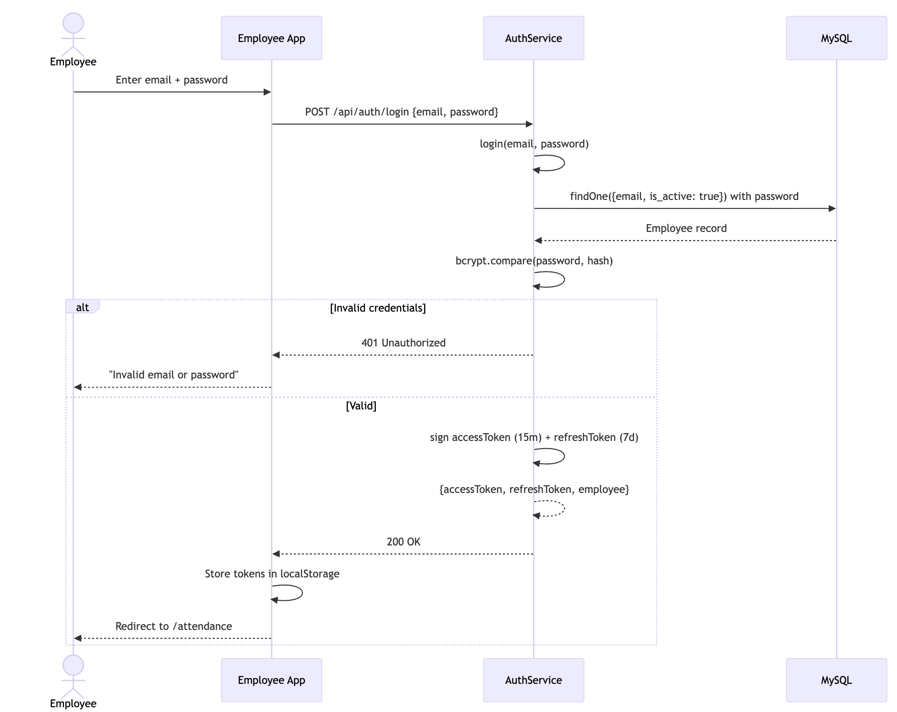

### 11.2 Clock In (Multiple per Day + Late Detection)

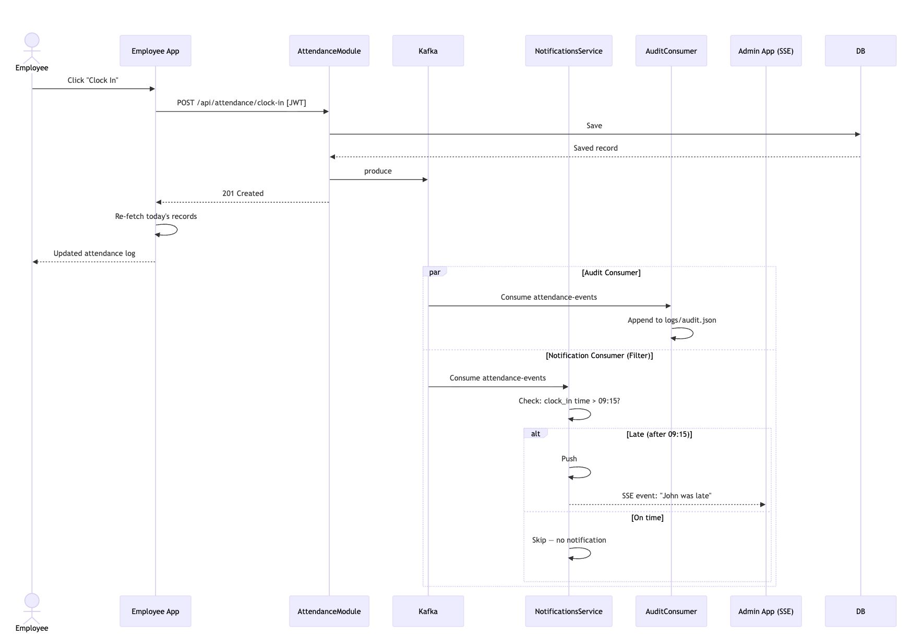

### 11.3 Clock Out (Active Session + Early Leave Detection)
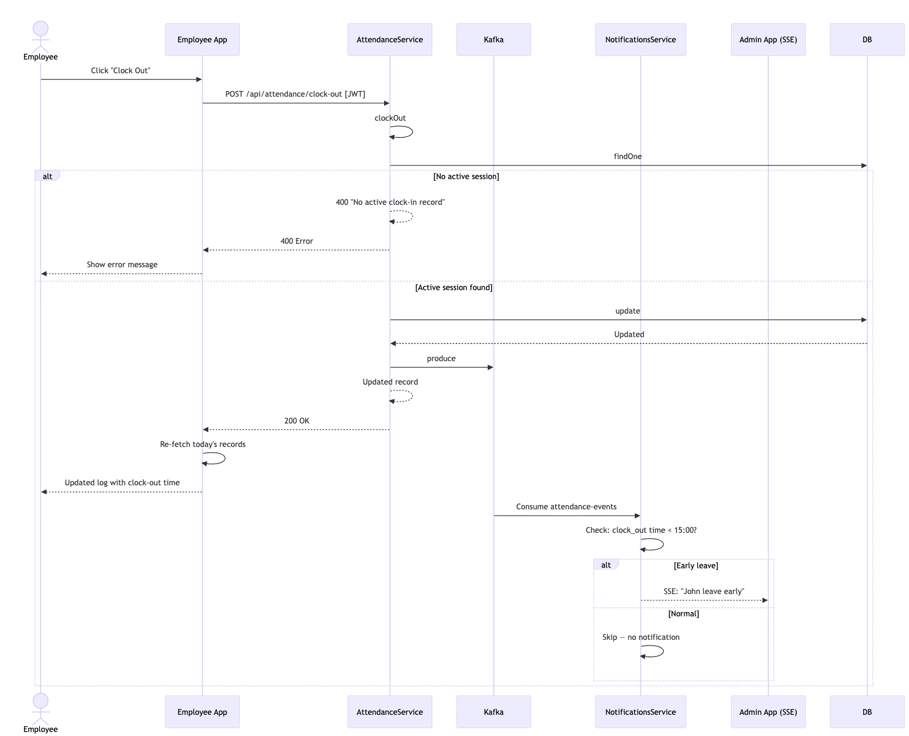

### 11.4 Profile Update (Kafka Fan-Out)
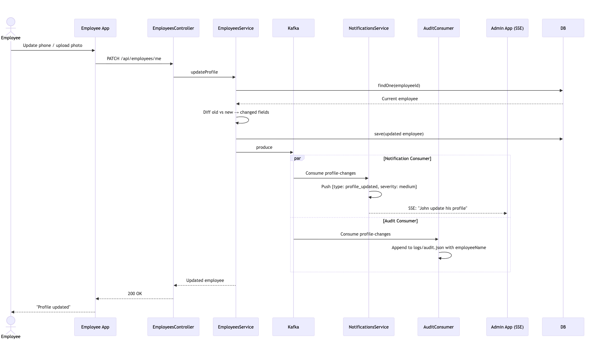

### 11.5 Admin — Employee Management (CRUD)
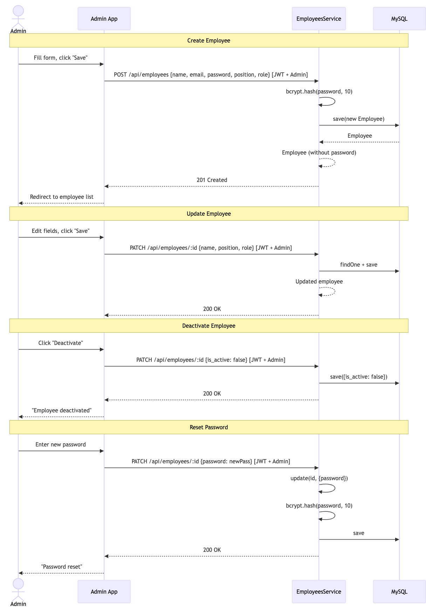

### 11.6 Admin — Attendance Monitoring

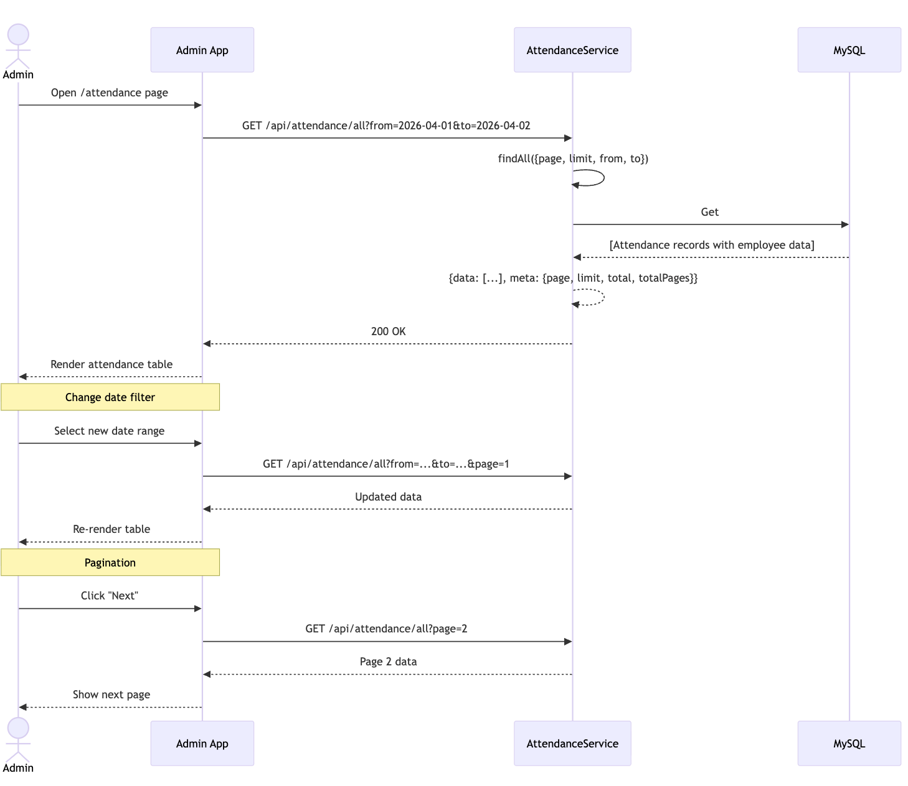


### 11.9 SSE Connection & Admin Notification Flow

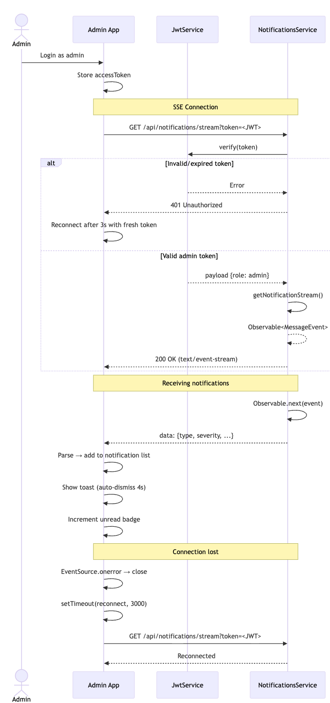

---

## 12. Infrastructure (Docker Compose)

| Service | Image              | Port  | Notes                                    |
|---------|--------------------|-------|------------------------------------------|
| mysql   | mysql:8            | 3306  | Persistent volume `mysql_data`. Init script creates `attendance_db` and `audit_db`. |
| kafka   | apache/kafka:3.7.0 | 9092  | KRaft mode (no Zookeeper). Auto-create topics enabled. |

Backend and frontends run locally (not containerized).

---

## 13. Assumptions

1. **Single instance deployment**: No horizontal scaling considerations. Kafka consumer groups are per-module, not per-instance.
2. **File-based audit log**: Acceptable for current scale. Not suitable for production — would need a dedicated audit DB or log aggregation service.
3. **TypeORM synchronize: true**: Schema auto-sync in non-production. Production should use migrations.
4. **No rate limiting**: Clock in/out endpoints have no throttling. Assumes trusted internal network.
5. **CORS open**: `app.enableCors()` with no origin restriction. Should be locked down for production.
6. **JWT secret fallback**: `process.env.JWT_SECRET || 'fallback-secret'` — the fallback must never be used in production.
7. **No soft delete**: Employee deletion cascades to attendance records.
8. **No timezone handling**: Dates use server timezone (`new Date().toISOString().split('T')[0]`).
9. **SSE token via query param**: Required because browser `EventSource` API doesn't support custom headers.

---

## 14. Rationale & Trade-offs

| Decision                         | Rationale                                                                                   |
|----------------------------------|---------------------------------------------------------------------------------------------|
| **Kafka over simple webhooks**   | Decouples producers from consumers. Audit and notification can evolve independently. Kafka provides durability and replay. |
| **RxJS Subject for SSE**         | Native NestJS `@Sse()` support. Subject allows multicasting to all connected clients with zero config. |
| **Two separate frontend apps**   | Admin and employee have different layouts, routes, and access patterns. Separate bundles keep each app lean. |
| **File-based audit vs DB**       | Simplicity for dev/demo. Append-only JSON log is easy to inspect. Clear upgrade path to DB-backed audit. |
| **Non-unique attendance index**  | Allows multiple clock in/out sessions per day. Business logic enforces ordering (clock out before next clock in). |
| **Tailwind CSS**                 | Utility-first approach speeds up UI development. No custom CSS maintenance. |
| **Vite over Webpack**            | Faster HMR, simpler config, native ESM support. Standard choice for React + TypeScript in 2026. |

---

## 15. Project Structure

```
dexa/
├── docker-compose.yml          # MySQL + Kafka
├── init-db.sql                 # DB initialization
├── backend/
│   └── src/
│       ├── main.ts             # Bootstrap, global pipes/filters
│       ├── app.module.ts       # Root module
│       ├── config/             # Database config
│       ├── common/             # Filters, interceptors, decorators
│       ├── auth/               # Login, JWT, guards
│       ├── employees/          # Employee CRUD, profile
│       ├── attendance/         # Clock in/out, summary
│       ├── kafka/              # Producer & consumer services
│       ├── audit/              # Kafka → file audit log
│       ├── notifications/      # Kafka → SSE (Observer pattern)
│       └── seeds/              # DB seeder
├── frontend/
│   ├── admin-app/              # React admin dashboard
│   └── employee-app/           # React employee self-service
└── docs/
    └── TECHNICAL_IMPLEMENTATION_PLAN.md
```

### 16. User interface

### Employee Profile

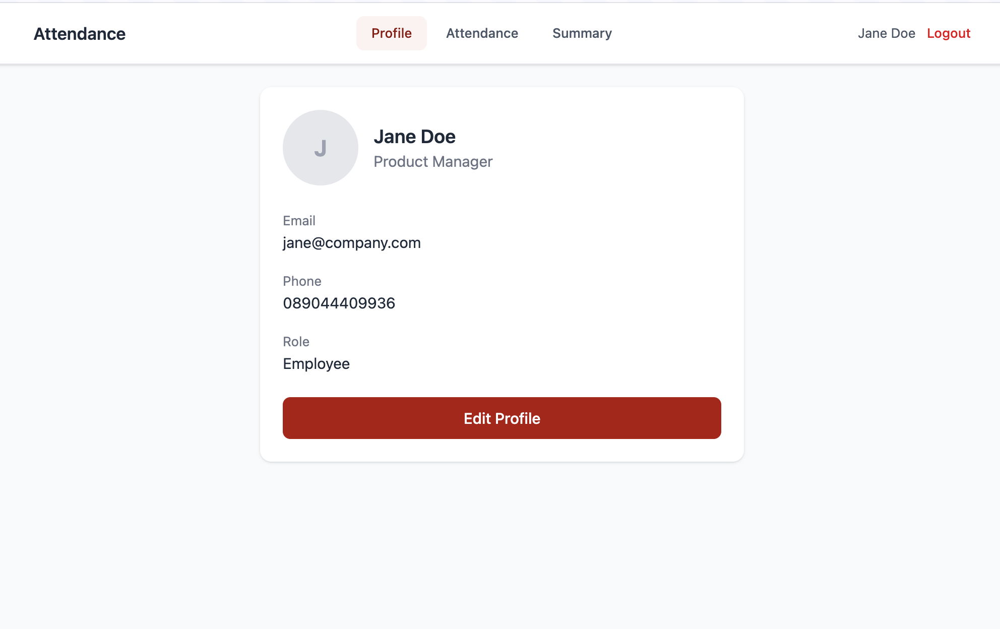
Edit form
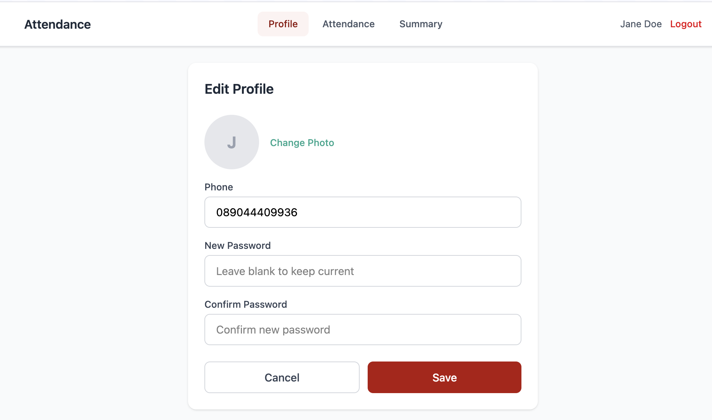
#### toast message
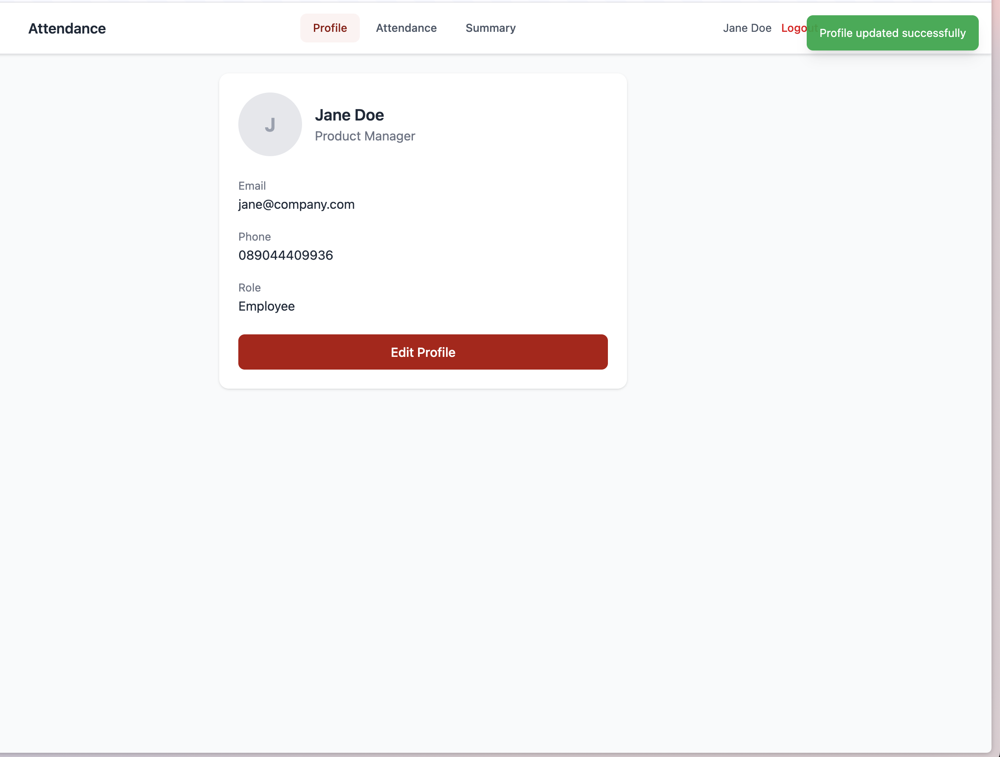

### Attendance (Clock-in/Clock-out)
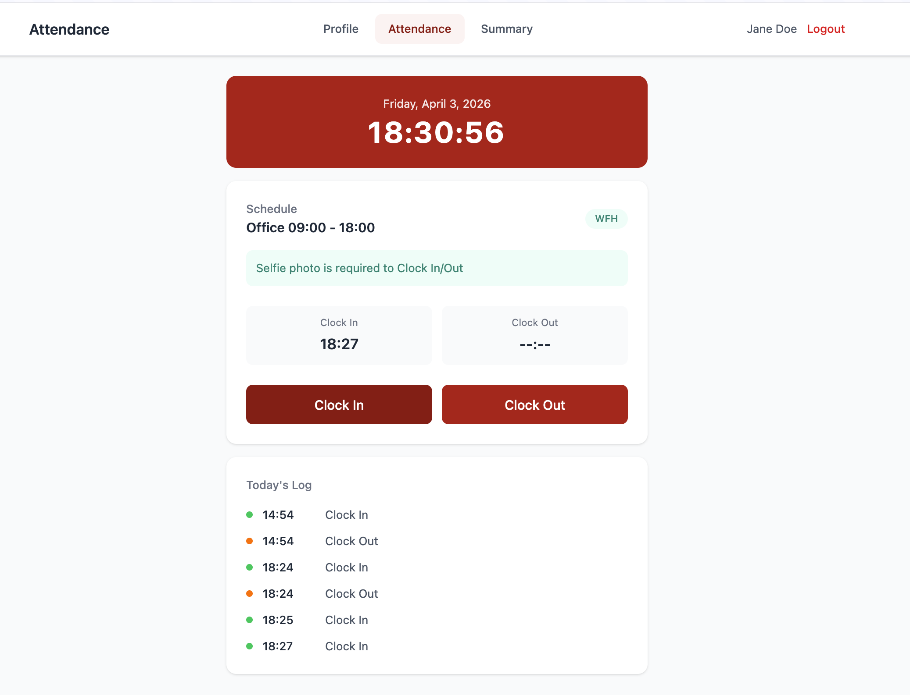


### Attendance Summary
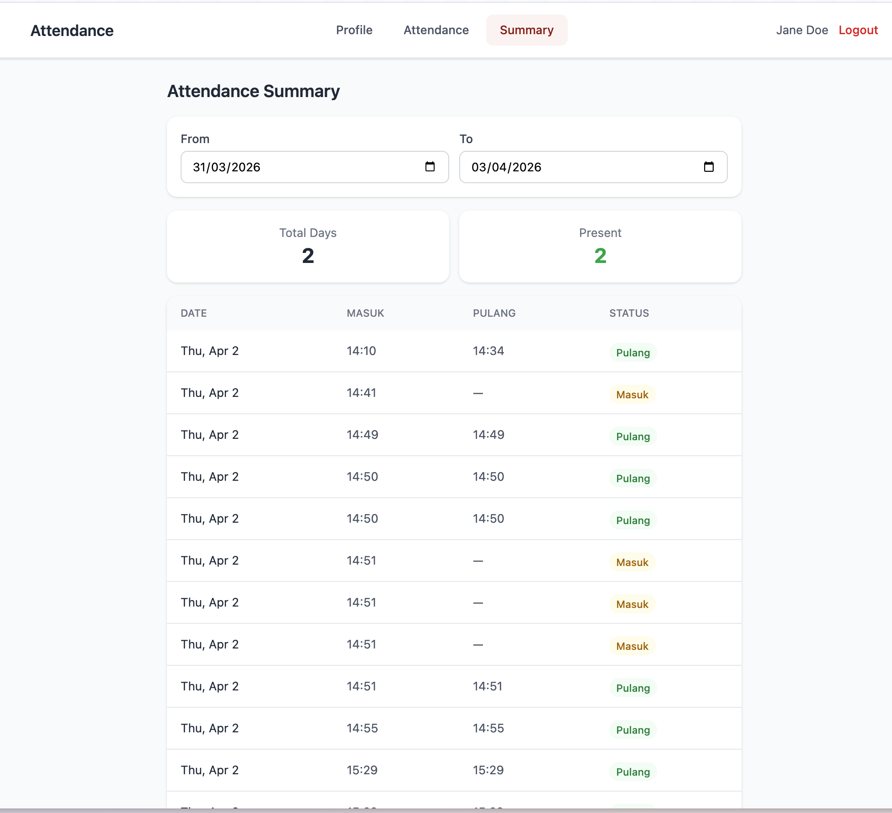
#### Date picker
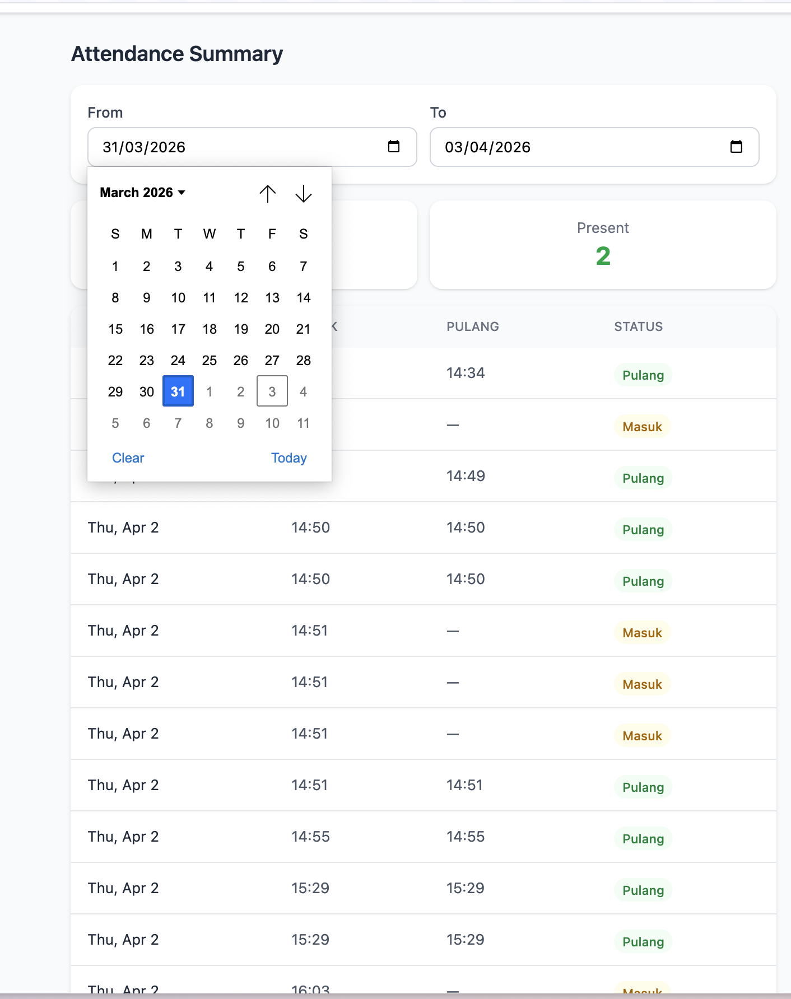

### Admin HR
#### Employee list
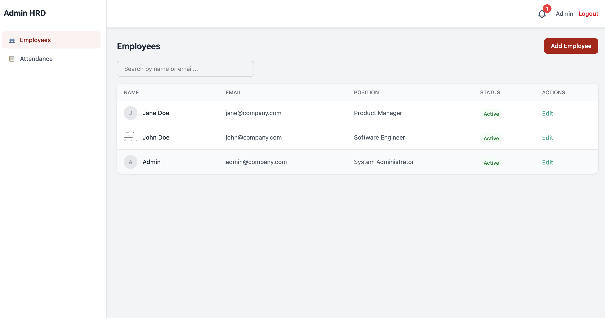
#### Add employee form
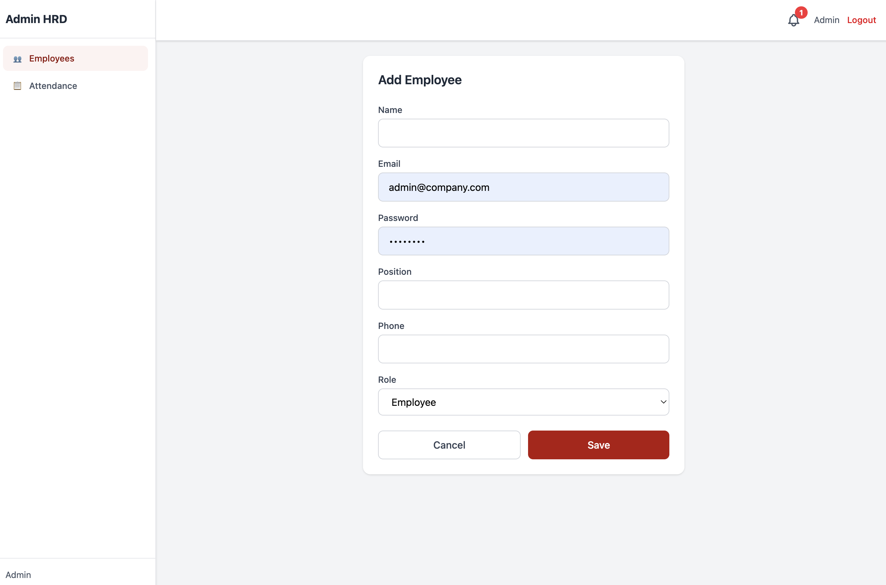
#### Edit Employee (edit, reset password, deactivate)
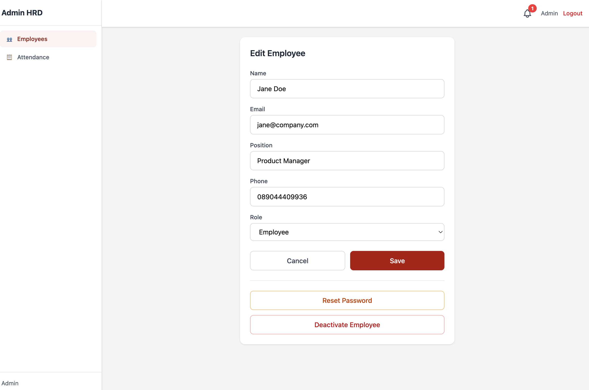

#### Attendance log
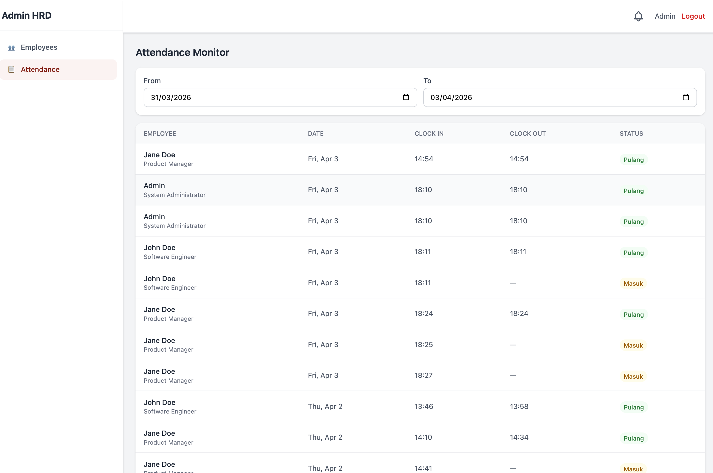

#### Notification
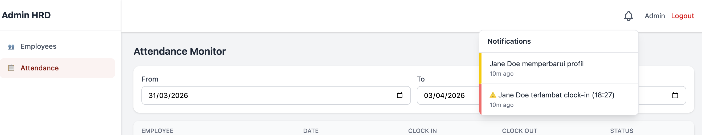